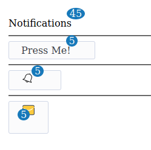

# Badge

Small count and labeling component. Badges are similar to labels; the primary difference is that the corners are more rounded. Badges are mainly used to highlight new or unread items.

## Expected

## Solutions

- Israel-Laguan
    

        
Example

        
    

